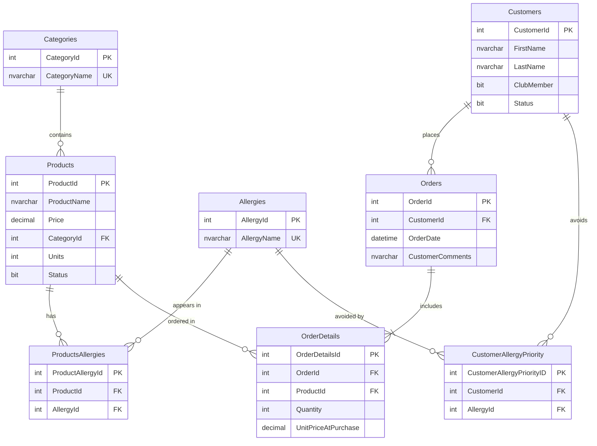

# 🧁 Bakery Database — SQL Server

A relational database for a bakery that sells ready-made products to private customers, built with **Microsoft SQL Server (T-SQL)**.

The bakery pays special attention to **allergies**: every product is linked to the allergens it may contain, and customers can register the allergens they want to avoid, so the system can show each customer only the products that are safe for them. The database also handles orders, stock, a customer club with a member discount, and sales reports.

> The data and comments in the code are in Hebrew. The full project book (in Hebrew) is in [`docs/project-book.pdf`](docs/project-book.pdf).

## What this project demonstrates

| Area | Examples |
|---|---|
| **Schema design** | 8 normalized tables, primary and foreign keys, `CHECK`, `UNIQUE` and `DEFAULT` constraints |
| **Many-to-many relationships** | `ProductsAllergies`, `CustomerAllergyPriority`, `OrderDetails` (junction tables with composite `UNIQUE` constraints) |
| **Triggers** | `INSTEAD OF INSERT` that blocks orders when stock runs out · `AFTER INSERT` that updates stock · `INSTEAD OF DELETE` for **soft delete** of products and customers |
| **Stored procedures** | Input validation, `TRANSACTION` with `TRY / CATCH`, and error handling |
| **Table-valued functions** | Products safe for a specific customer · products without a given allergen · the most expensive product in each category (correlated subquery with `>= ALL`) |
| **Scalar functions** | Final order price with a 5% club discount · most profitable day of a month · do club members spend more than other customers? |
| **Views** | Products with their allergens · full order details |
| **Queries** | `JOIN` / `LEFT JOIN`, `GROUP BY` and `HAVING`, aggregations, `TOP`, sorting and variables |

**Business rule worth noting:** `OrderDetails.UnitPriceAtPurchase` stores each item's price at the time of purchase, so changing a product's price later does not change past orders.

## Database diagram



## Project structure

```
sql/
├── 01_create_database.sql    -- database and tables
├── 02_views.sql
├── 03_functions.sql          -- table-valued and scalar functions
├── 04_stored_procedures.sql
├── 05_triggers.sql
├── 06_seed_data.sql          -- sample data
└── 07_queries.sql            -- reporting queries
docs/
└── project-book.pdf          -- project book (Hebrew)
```

## How to run

1. Open **SQL Server Management Studio (SSMS)**.
2. Run the files in `sql/` **in numeric order** (01 → 07).
3. Try a few examples:

```sql
-- Products that are safe for customer #6 (avoids gluten and milk)
SELECT * FROM dbo.GetPriorityProdCus(6);

-- Final price of order #3, with the club-member discount applied
SELECT dbo.FinalOrderPrice(3) AS FinalPrice;

-- Ordering more than the stock is blocked by the trigger
EXEC AddOrderItem 1, 6, 2000;

-- Soft delete: the product stays in the table with Status = 0
EXEC DeleteProduct 1;
SELECT ProductId, ProductName, Status FROM Products WHERE ProductId = 1;
```

## Technologies

Microsoft SQL Server · T-SQL · SSMS
